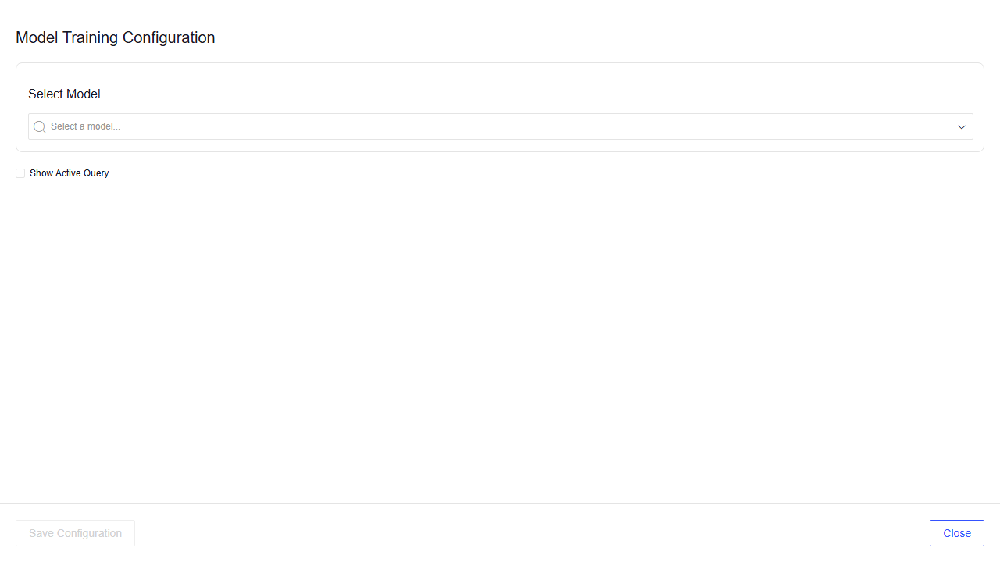
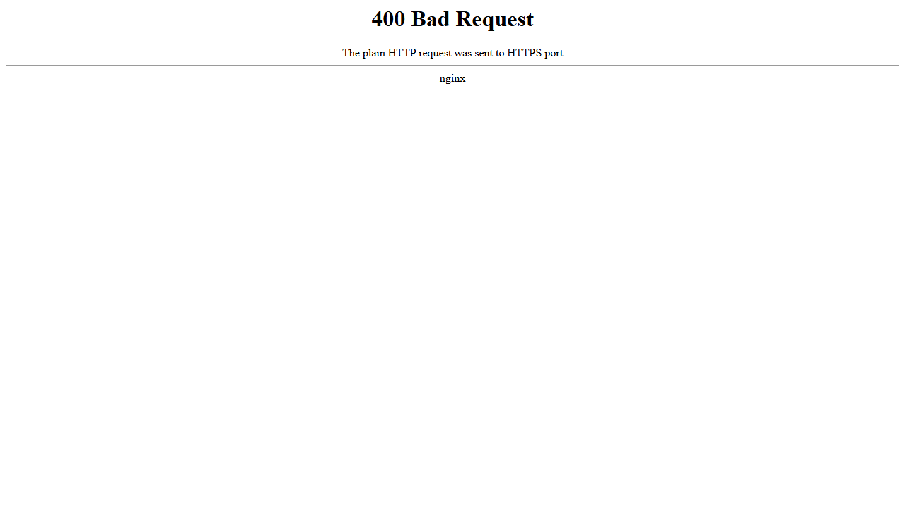

# README & DX Walkthrough — Test Results

Live testing performed 2026-02-26 against both `main` (broken) and `improve/readme-and-dx` (fixed).

---

## Phase 1: BEFORE (on `main`)

### App 1: example-panel-toolbar

**Step 1 — README auth instructions:**
README says:
```bash
pip install dtlpy
dl.login()
```
But `scripts/login.py` actually reads `DTLPY_ENV` and `DTLPY_TOKEN` from `.env` and calls `dl.login_token()`. A user following the README would never create a `.env` file.

**FAILURE: Auth instructions don't match how the code works.**

**Step 2 — Missing env.example:**
```
$ ls env.example
ls: cannot access 'env.example': No such file or directory

$ ls .env
ls: cannot access '.env': No such file or directory
```
**FAILURE: No template file. User has no idea what env vars are needed.**

**Step 3 — Container without .env:**
```
$ docker run ... examplepaneltoolbar:phase1
Traceback (most recent call last):
  File "/tmp/app/scripts/login.py", line 9, in <module>
    dl.setenv(env)
  File ".../api_client.py", line 1516, in setenv
    if env.startswith('http'):
AttributeError: 'NoneType' object has no attribute 'startswith'
```
**FAILURE: login.py crashes — DTLPY_ENV is None because no .env exists.**

**Step 4 — HTTP vs HTTPS:**
```
$ curl http://localhost:3004/model_configurator   → 400 Bad Request
$ curl https://localhost:3004/model_configurator  → 200 OK
```
README says `http://localhost:3004/model_configurator`. Nginx only listens on SSL (`listen 3000 ssl;`).

Following the README's HTTP URL:


Using HTTPS instead (undocumented):


**FAILURE: README URL doesn't work. Users get a 400 error page with no explanation.**

### App 2: example-route-slot

**Step 1 — cp env.example .env:**
```
$ cp env.example .env
cp: cannot stat 'env.example': No such file or directory
```
**FAILURE: Immediate blocker at Step 2 of the README. File doesn't exist.**

**Step 2 — Missing login.py:**
```
$ ls scripts/login.py
ls: cannot access 'scripts/login.py': No such file or directory
```
README project structure diagram lists `login.py` — it doesn't exist.

**FAILURE: README lies about project structure.**

**Step 3 — start_dev.sh has no auth:**
```bash
#!/bin/sh
python -m uvicorn "scripts.app:app" ...
```
No call to `login.py`. The Dataloop SDK starts without authentication.

**FAILURE: Container runs but SDK is unauthenticated.**

**Step 4 — install.py uses interactive login:**
```python
dl.login()  # opens a browser popup
```
Panel-toolbar uses token auth from `.env`; route-slot uses interactive browser login. Inconsistent and won't work in CI/headless.

**FAILURE: install.py can't run non-interactively.**

**Step 5 — HTTP vs HTTPS:**
Same as panel-toolbar. README says `http://`, nginx requires `https://`.
```
$ curl http://localhost:3004/route-slot   → 400 Bad Request
$ curl https://localhost:3004/route-slot  → 200 OK
```

Following the README's HTTP URL:


Using HTTPS instead (undocumented):


> Note: The route-slot app renders blank in a standalone browser because the Vue components need the Dataloop platform frame driver context to display content. The 200 response and correct HTML confirm the server is working.

**FAILURE: README URL doesn't work.**

### Phase 1 Difficulty Rating: 4/10 — impossible to complete

A new developer following either README literally would be blocked within the first 2-3 steps. The panel-toolbar app crashes on start; the route-slot app can't even begin setup (`env.example` missing).

---

## Phase 3: AFTER (on `improve/readme-and-dx`)

### App 1: example-panel-toolbar

**Step 1 — env.example exists:**
```
$ cat env.example
# Dataloop environment (usually "prod")
DTLPY_ENV=prod
# Your Dataloop authentication token
...
DTLPY_TOKEN=your_token_here
```
PASS

**Step 2 — cp env.example .env:**
```
$ cp env.example .env
$ # Edit .env with real token
```
PASS

**Step 3 — Docker build:**
```
$ docker build --rm -f local.Dockerfile -t examplepaneltoolbar:phase3 .
# ... builds successfully
```
PASS (note: `--pull` removed from README default, avoiding potential auth issues with `hub.dataloop.ai`)

**Step 4 — Container starts cleanly:**
```
INFO:     Uvicorn running on http://0.0.0.0:5463
VITE v5.1.6  ready in 4065 ms
  ➜  Local:   http://localhost:8084/model_configurator
```
No login.py errors. All three services (uvicorn, Vite, nginx) started.

PASS

**Step 5 — HTTPS URL works:**
```
$ curl -sk https://localhost:3004/model_configurator → 200
  <!DOCTYPE html>
  <html lang="en">
    <head>
      <title>DL Model Configurator - 2025</title>
    ...
```



PASS

**Step 6 — HTTP still returns 400 (expected — documented in troubleshooting):**



PASS — the README now correctly documents `https://` and the troubleshooting table explains this.

**Step 7 — API responds:**
```
$ curl -sk https://localhost:3004/api/models → 422
```
422 is expected (needs query params from the Vue frontend). Backend is alive and authenticated.

PASS

### App 2: example-route-slot

**Step 1 — env.example exists:**
```
$ cat env.example   # identical template
```
PASS

**Step 2 — login.py exists:**
```
$ cat scripts/login.py
import dtlpy as dl
from dotenv import load_dotenv
...
dl.login_token(token)
```
PASS

**Step 3 — start_dev.sh calls login.py:**
```bash
#!/bin/sh
# Authenticate to Dataloop using dtlpy with env and token from .env
python scripts/login.py
python -m uvicorn ...
```
PASS

**Step 4 — Container starts cleanly:**
```
INFO:     Uvicorn running on http://0.0.0.0:5463
VITE v5.4.21  ready in 2907 ms
  ➜  Local:   http://localhost:8084/route-slot
```
PASS

**Step 5 — HTTPS URL works:**
```
$ curl -sk https://localhost:3004/route-slot → 200
  <!DOCTYPE html>
  <html lang="en">
    <title>Route Slot Example</title>
    ...
```


> Note: Renders blank in standalone browser (needs Dataloop platform context). The 200 response and correct HTML confirm the server is working correctly.

PASS

**Step 6 — API health endpoint:**
```
$ curl -sk https://localhost:3004/api/health
{"status":"ok"}
```
PASS

**Step 7 — install.py uses token auth:**
```python
dl.setenv(env)
dl.login_token(token)
```
Matches panel-toolbar. No browser popup.

PASS

### Phase 3 Difficulty Rating: 9/10 — straightforward, works first try

---

## Changes That Fixed It

| File | What Changed |
|------|-------------|
| `example-route-slot/scripts/login.py` | **Created** — was missing entirely |
| `example-panel-toolbar/env.example` | **Created** — template so users know what to put in `.env` |
| `example-route-slot/env.example` | **Created** — same template |
| `example-route-slot/start_dev.sh` | **Added** `python scripts/login.py` before uvicorn |
| `example-route-slot/scripts/install.py` | **Replaced** interactive `dl.login()` with token auth from `.env` |
| `example-panel-toolbar/README.md` | **Rewritten** — HTTPS URLs, env setup steps, troubleshooting |
| `example-route-slot/README.md` | **Rewritten** — accurate project structure, standardized auth |
| `README.md` (root) | **Updated** — architecture diagram, credential setup, HTTPS URLs |
